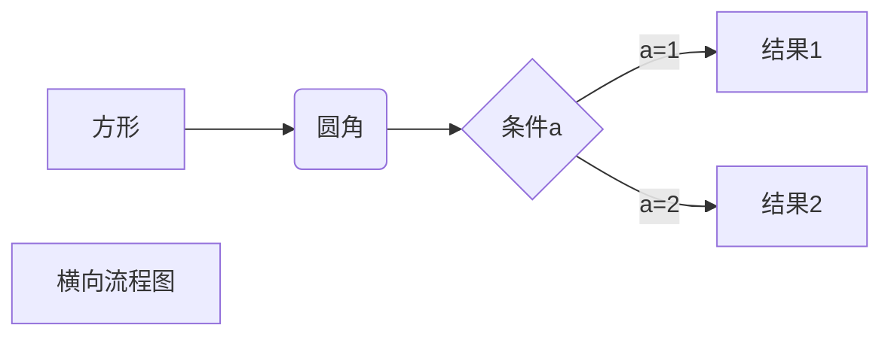
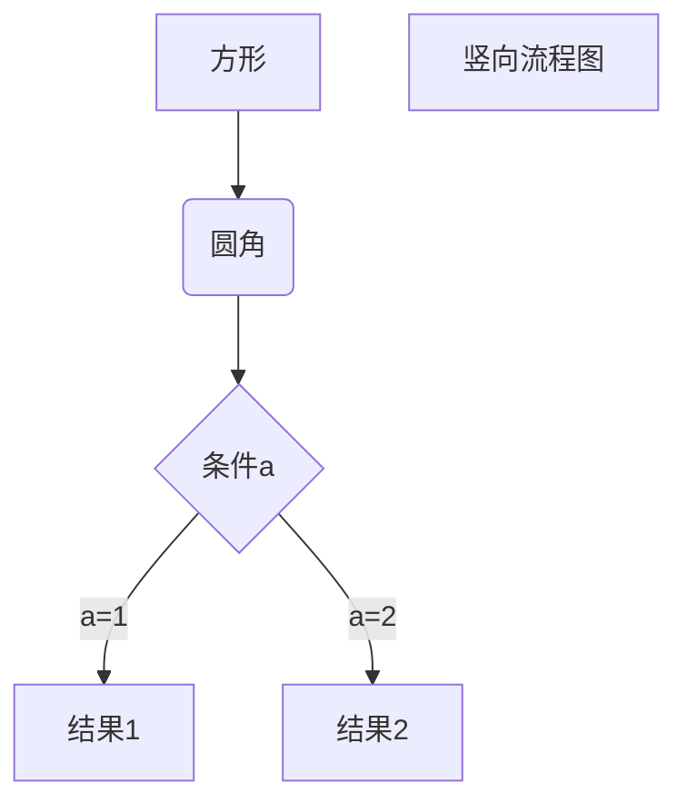
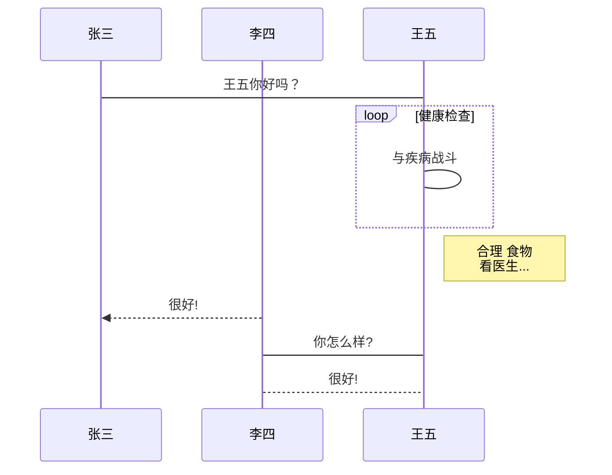
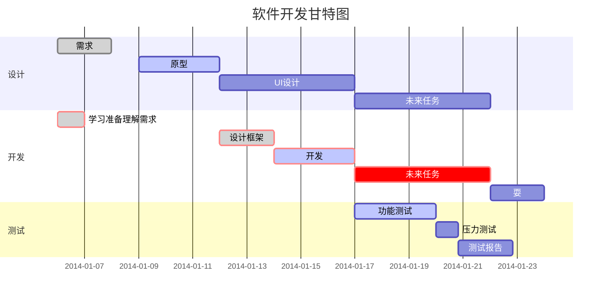

# 一级标题
## 二级标题
### 三级标题
#### 四级标题
##### 五级标题
###### 六级标题

我展示的是一级标题
=

我展示的是二级标题
-

*斜体文本*
_斜体文本_
**粗体文本**
__粗体文本__
***粗斜体文本***
___粗斜体文本___


可以在一行中用三个以上的星号、减号、底线来建立一个分隔线，行内不能有其他东西。你也可以在星号或是减号中间插入空格。

***
* * *
*****
- - -
----------

~~删除线~~
<u>下划线</u>
[^脚注]

无序列表使用星号(*)、加号(+)或是减号(-)作为列表标记，这些标记后面要添加一个空格，然后再填写内容
* 第一项
* 第二项
* 第三项

+ 第一项
+ 第二项
+ 第三项

- 第一项
- 第二项
- 第三项

有序列表使用数字并加上.号来表示
1. 第一项
2. 第二项
3. 第三项

列表嵌套只需在子列表中的选项前面添加四个空格即可：
1. 第一项：
    - 第一项嵌套的第一个元素
    - 第一项嵌套的第二个元素
2. 第二项：
    - 第二项嵌套的第一个元素
    - 第二项嵌套的第二个元素

Markdown 区块引用是在段落开头使用 > 符号 ，然后后面紧跟一个空格符号：
> 区块引用
> 菜鸟教程
> 学的不仅是技术更是梦想

另外区块是可以嵌套的，一个 > 符号是最外层，两个 > 符号是第一层嵌套，以此类推：
> 最外层
> > 第一层嵌套
> >
> > > 第二层嵌套

> 区块中使用列表
> 1. 第一项
> 2. 第二项
> + 第一项
> + 第二项
> + 第三项

列表中使用区块
如果要在列表项目内放进区块，那么就需要在 > 前添加四个空格的缩进。
* 第一项
    > 菜鸟教程
    > 学的不仅是技术更是梦想
* 第二项

如果是段落上的一个函数或片段的代码可以用反引号把它包起来\'
`printf()` 函数

代码区块使用 4 个空格或者一个制表符（Tab 键）
    
    int main(){
        return 0;
    }

你也可以用 ``` 包裹一段代码，并指定一种语言（也可以不指定）：
```javascript
$(document).ready(function () {
    alert('RUNOOB');
});
```

这是一个链接 [菜鸟教程](https://www.runoob.com)

直接使用链接地址
<https://www.runoob.com>

高级链接
我们可以通过变量来设置一个链接，变量赋值在文档末尾进行：

这个链接用 1 作为网址变量 [Google][1]
这个链接用 runoob 作为网址变量 [Runoob][runoob]
然后在文档的结尾为变量赋值（网址）

[1]: http://www.google.com/
[runoob]: http://www.runoob.com/

Markdown 图片语法格式如下：


Markdown 还没有办法指定图片的高度与宽度，如果你需要的话，你可以使用普通的 \ 标签。


Markdown 制作表格使用 | 来分隔不同的单元格，使用 - 来分隔表头和其他行。
语法格式如下：
|  表头   | 表头  |
|  ----  | ----  |
| 单元格  | 单元格 |
| 单元格  | 单元格 |

我们可以设置表格的对齐方式：
-: 设置内容和标题栏居右对齐。
:- 设置内容和标题栏居左对齐。
:-: 设置内容和标题栏居中对齐。
实例如下：
| 左对齐 | 右对齐 | 居中对齐 |
| :-----| ----: | :----: |
| 单元 | 单元 | 元 |
| 单元格 | 单元格 | 单元格 |

支持的 HTML 元素
不在 Markdown 涵盖范围之内的标签，都可以直接在文档里面用 HTML 撰写。
目前支持的 HTML 元素有：\<kbd> \<b> \<i> \<em> \<sup> \<sub> \<br>等 ，如：
使用 <kbd>Ctrl</kbd>+<kbd>Alt</kbd>+<kbd>Del</kbd> 重启电脑

Markdown Preview Enhanced 使用 KaTeX 或者 MathJax 来渲染数学表达式。KaTeX 拥有比 MathJax 更快的性能，但是它却少了很多 MathJax 拥有的特性。你可以查看 KaTeX supported functions/symbols 来了解 KaTeX 支持那些符号和函数。
默认下的分隔符：
\$...\$ 或者 \\(...\\) 中的数学表达式将会在行内显示。
\$\$...\$\$ 或者 \\[...\\] 或者 ```math 中的数学表达式将会在块内显示。

$$
\begin{Bmatrix}
   a & b \\
   c & d
\end{Bmatrix}
$$
$$
\begin{CD}
   A @>a>> B \\
@VbVV @AAcA \\
   C @= D
\end{CD}
$$

1、横向流程图源码格式：


2、竖向流程图源码格式：


3、标准流程图源码格式：

```flow
st=>start: 开始框
op=>operation: 处理框
cond=>condition: 判断框(是或否?)
sub1=>subroutine: 子流程
io=>inputoutput: 输入输出框
e=>end: 结束框
st->op->cond
cond(yes)->io->e
cond(no)->sub1(right)->op
```
4、标准流程图源码格式（横向）：

```flow
st=>start: 开始框
op=>operation: 处理框
cond=>condition: 判断框(是或否?)
sub1=>subroutine: 子流程
io=>inputoutput: 输入输出框
e=>end: 结束框
st(right)->op(right)->cond
cond(yes)->io(bottom)->e
cond(no)->sub1(right)->op
```
5、UML时序图源码样例：

```sequence
对象A->对象B: 对象B你好吗?（请求）
Note right of 对象B: 对象B的描述
Note left of 对象A: 对象A的描述(提示)
对象B-->对象A: 我很好(响应)
对象A->对象B: 你真的好吗？
```
6、UML时序图源码复杂样例：

```sequence
Title: 标题：复杂使用
对象A->对象B: 对象B你好吗?（请求）
Note right of 对象B: 对象B的描述
Note left of 对象A: 对象A的描述(提示)
对象B-->对象A: 我很好(响应)
对象B->小三: 你好吗
小三-->>对象A: 对象B找我了
对象A->对象B: 你真的好吗？
Note over 小三,对象B: 我们是朋友
participant C
Note right of C: 没人陪我玩
```
7、UML标准时序图样例：


8、甘特图样例：



